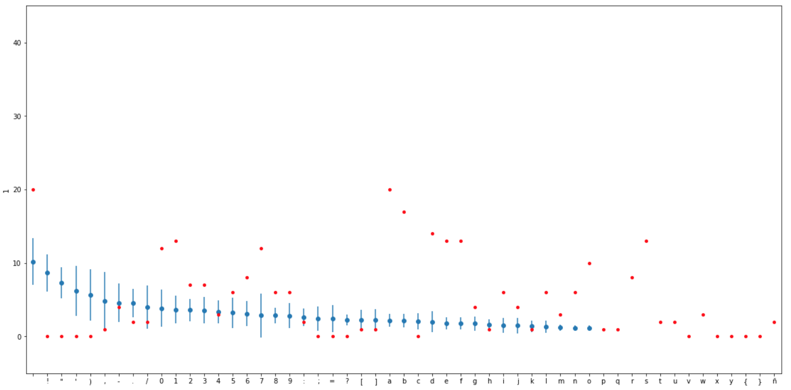
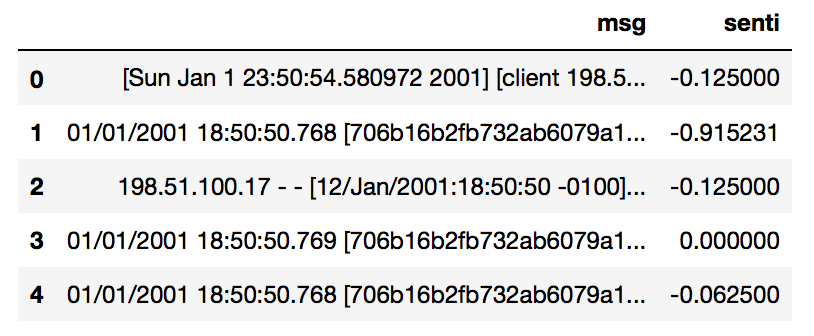
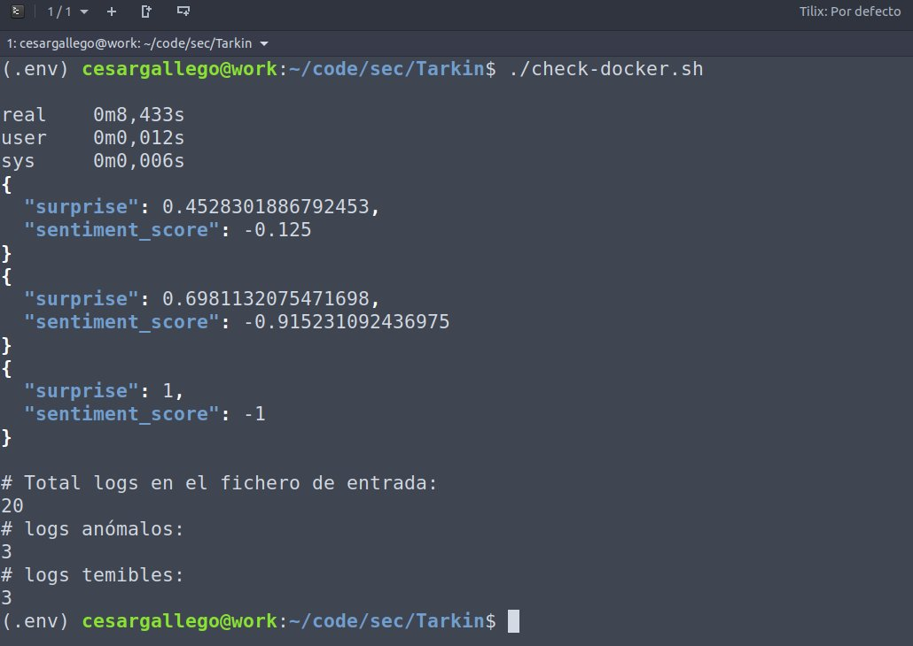

# What is Tarkin?

Tarkin is an extensible project that allows to emulate the intuition of human analysts at scale and immediately 
raise awareness of anomalies by running models based on different aspects of the relevant experience domain in streaming. 

# Introduction

Detecting anomalies is a hard job that usually requires going through zillions of log lines, queue messages, database registers, etc. 
There are tools to automate to some extent this classification and throw alerts, but only at the costly price of retagging misclassified messages
and constantly update rules.  

# Quick Start

# Running the example code

Tarkin provides:

* A model pipelining engine capable of running training and prediction tasks in streaming.
* A simple but powerful way to define data ETLs previous to the pipeline execution.  
* An examples module in which you'll find a demonstrative pipeline based on "fear-inspired" models.

There are several shell scripts available in the project's examples module:

* build.sh: Initializes the environment creating the necessary folders and building the docker images.

The project can be run in your own machine and python installation. You will first need to run the training script, then
you can execute check.sh or check-demo.sh to analyze files configured in the same script or quoted sentences
passed as command line parameters, respectively.

* train.sh: Starts the training of the letter frequency model, producing a letterspace.pkl binary file.
* check.sh: Evaluates the infrequency and applies sentiment analysis to the logs of the file configured in the script.     
* check-demo.sh: Useful for demo purposes; evaluates the infrequency and applies sentiment analysis to a quoted sentence
received as a script parameter. NOTICE: unlike check.sh, this script returns an evaluation result even if the sentiment
score value is above 0.   

You can also run the dockerized version of the project, which is launched using the following equivalent shell scripts:

* train-docker.sh
* check-docker.sh
* check-demo-docker.sh

# Requirements

You need Python 3.6.x or later to run Tarkin. You can have multiple Python versions (2.x and 3.x) installed on the same system without problems.

In Ubuntu, Mint and Debian you can install Python 3 like this:

    $ sudo apt-get install python3 python3-pip
    
In OS X you can install Python using [Brew](https://brew.sh) like this:

    $ brew install python3

For other Linux flavors and Windows, packages are available at

[http://www.python.org/getit/](http://www.python.org/getit/)

To run the project in your python3 environment, you will need to install the dependencies in the requirements.txt file, and
it's highly recommended to create a separate virtual env, see below. Execute the following n a terminal window:

    $ cd Tarkin
    $ pip install -r requirements.txt

Then, you will need to run the following command:

    $ python -m spacy download en

## Working with virtualenv

If you are using virtualenv, make sure you are running a python3 environment. Installing via pip3 in a v2 environment
will not configure the environment to run installed modules from the command line.

    $ python3 -m pip install -U virtualenv
    $ python3 -m virtualenv env
    $ source ./env/bin/activate  # Enter into VirtualEnv

## How does it work (in a nutshell)

The first step is training a character frequency model with a messages sample, then apply it to the content of testing/fresh incoming messages: 

Then, add sentiment analysis on top of that to show only messages with an overall negative meaning:

The resulting output is an indicator of the "fear" perceived in each message by the system, which is used to filter out the ones
below a threshold set by the model:

## Notebooks

The project includes a notebook to illustrate how the fear indicator is calculated. Before being able to run it, 
you'll need to execute the following commands from your virtual env:

    $ python3 -m pip install jupyter seaborn matplotlib
    $ jupyter notebook

Then navigate on your browser to Tarkin/notebooks from the Jupyter Home tree 
and open the file <code>Log Mining.ipynb</code>. 

In case you experience an error running the notebook cells, make sure you executed the <code>./build.sh</code> script 
that sets up the project by building the docker images and downloading the default lexicon dictionary, which is used 
by the notebook, or do it again if unsure.

# What about the name?

The project is named after the Grand Moff Tarkin, the famous Star Wars character who envisioned a governing system based
on the fear of the Death Star that would allow the Empire to rule the galaxy without the burden of bureaucracy. 

# Contributing

Feedback, ideas and contributions are welcome. For more details, please see the [CONTRIBUTING.md](CONTRIBUTING.md) file.

# License

This project is distributed under the [Apache License](http://www.apache.org/licenses/LICENSE-2.0)
